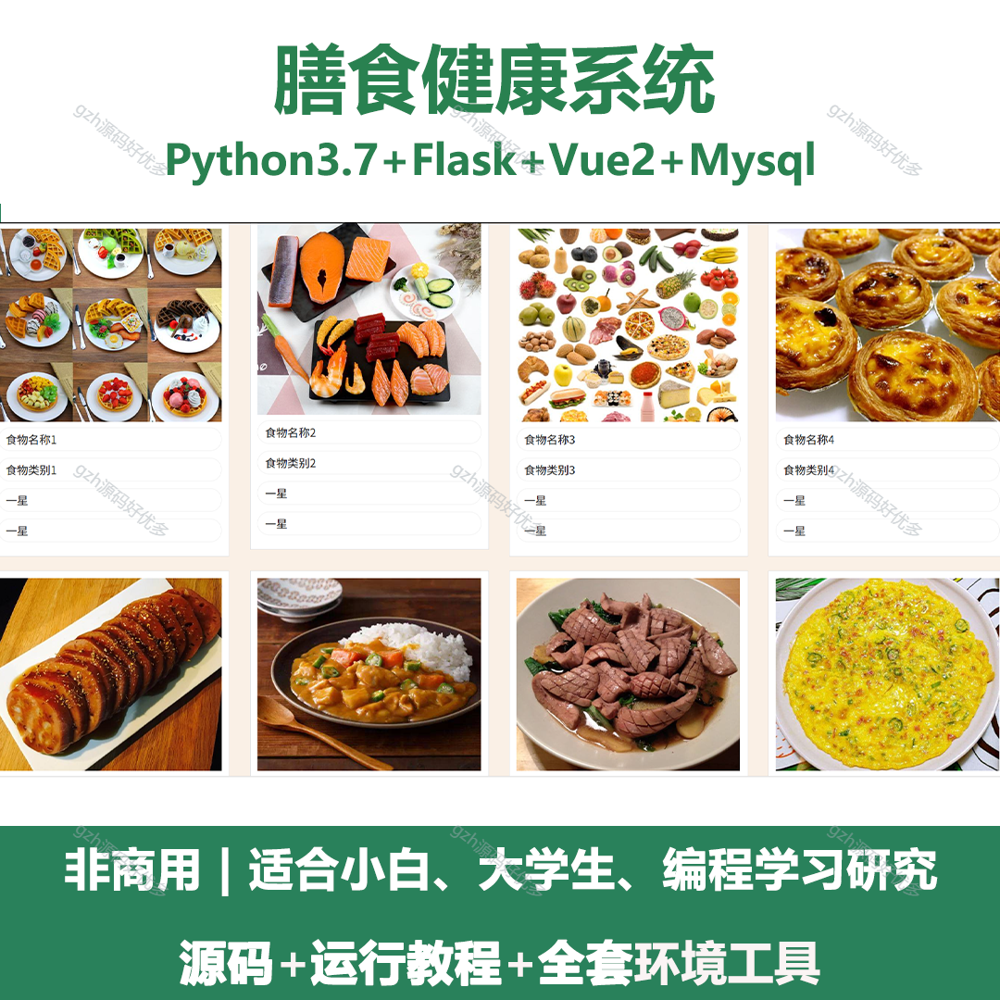
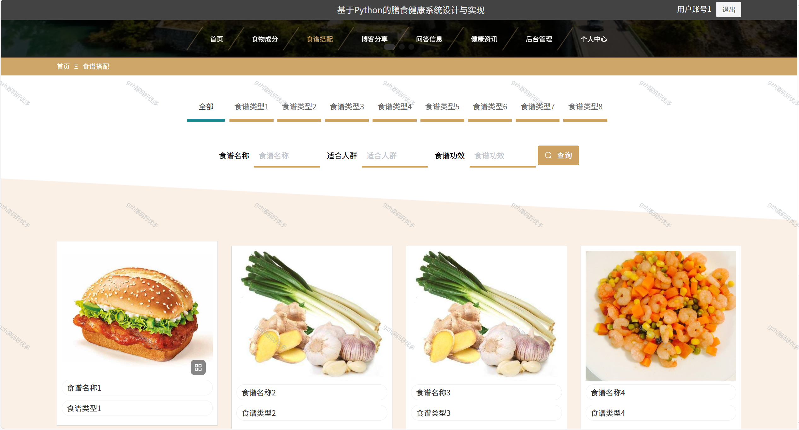
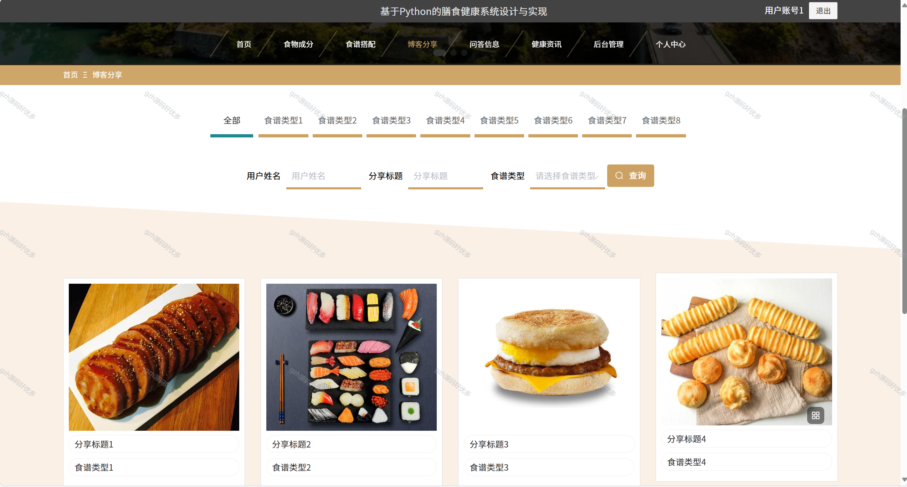
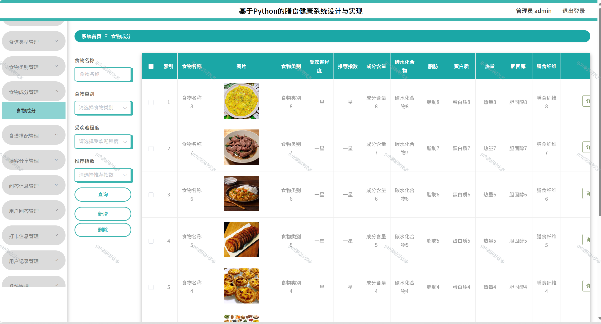
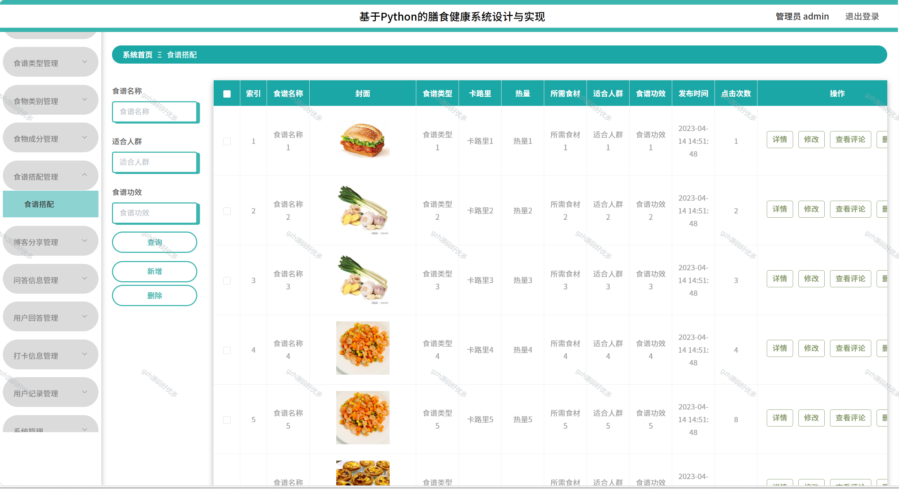
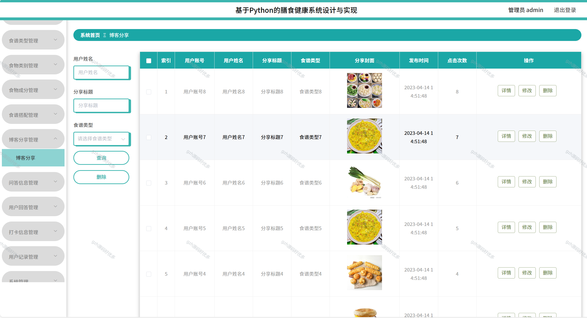
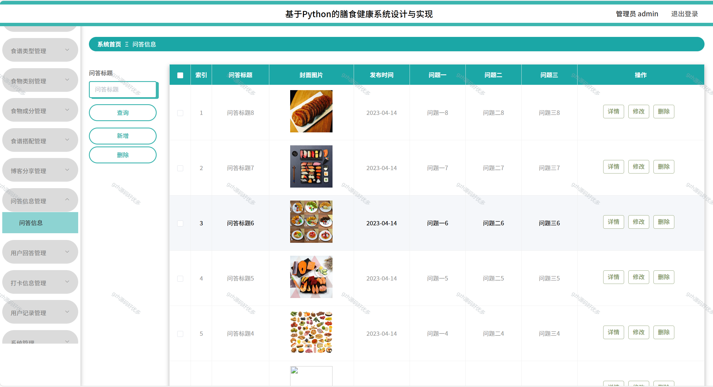

# python099
python099基于Python+Flask的膳食健康系统
 
## 查看主页获取源码

### 一、关键词
膳食营养系统，膳食健康管理系统，饮食调理系统

### 二、作品包含
源码+数据库+全套环境和工具资源+本地部署教程

### 三、项目技术
前端技术：Vue2.0、Element-ui
后端技术：Python3.7、Flask

### 四、运行环境（以下版本亲测，其他版本兼容性请自行测试）
开发工具：PyCharm + VSCODE

数据库：MySQL5.7（最低要5.7版本）

数据库管理工具：Navicat10+

Python：Python3.7

前端Nodejs：14

浏览器：谷歌浏览器

### 五、项目介绍
项目编号：python099

膳食健康系统能科学管理日常饮食，通过定制营养方案、追踪摄入数据，帮助用户平衡营养素摄入，预防饮食相关健康问题；还能结合个人情况动态调整饮食计划，助力实现健康目标。
基于 Python 的膳食健康系统，用户端可浏览食谱、食物成分、博客分享等内容；管理端能对食谱、食物、博客、问答等信息进行增删改查及分类管理 。

### 六、运行截图

